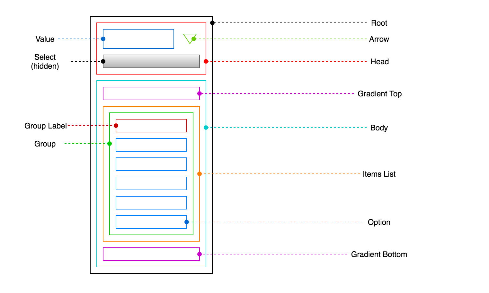

# EasyDropDown 4

[](https://travis-ci.org/patrickkunka/easydropdown)
[](https://coveralls.io/github/patrickkunka/easydropdown)
[](https://www.npmjs.com/package/easydropdown)
[](https://www.apache.org/licenses/)

EasyDropDown transforms the humble `<select>` element into a blank canvas for your design and brand. As a drop-in enhancement, EasyDropDown maintains all the functionality and accessibility of a standard single-option select menu, while exposing a semantic DOM-structure that's easy to style and customize to the needs of your design.

EasyDropDown comes bundled with three [ready-made themes](./demos/themes) which can be used as a starting point for custom styling.

Check out the **[demos](https://demos.kunkalabs.com/easydropdown/)** to see what's possible. The source code for the demos can be found in the [./demos/](./demos/) directory.

*NB: If you are viewing the demos on a mobile device, you will see the device's native select UI as per the [default configuration](#usenativeuionmobile).*

### Features
- Respects the native `<select>` element API*
- Full keyboard support (navigation, search and select)
- Emits native `change` events
- Enhanced placeholder support
- Form reset and validation support
- Collision detection
- Live updates
- Falls back to native UI on mobile devices
- CSS Modules support
- TypeScript/intellisense support
- ARIA-compliant-markup
- Support for IE9+, and all modern browsers.
- 9kb gzipped
- No third-party dependencies

**EasyDropDown [does not support](#multiple-attribute-support) the `multiple` attribute.*

#### Contents

- [Installation](#installation)
- [Usage](#usage)
    - [Single-instance instantiation](#single-instance-instantiation)
    - [Batch instantiation](#batch-instantiation)
    - [Placeholder Functionality](#placeholder-functionality)
    - [Reading and Writing Values](#reading-and-writing-values)
- [Anatomy of EasyDropDown](#anatomy-of-easydropdown)
- [Configuration Options](#configuration-options)
    - [Available Options](#available-options)
- [API Methods](#api-methods)
- [React Example](#react-example)
- [CSS Modules Example](#css-modules-example)
- [TypeScript Support](#typescript-support)
- [Multiple Attribute Support](#multiple-attribute-support)

## Installation

Firstly, install the package using your package manager of choice.

```
npm install easydropdown --save
```

#### Module Import

You may then import the `easydropdown()` factory function into your project's modules.

```js
// ES Modules
import easydropdown from 'easydropdown';

// CommonJS
const easydropdown = require('easydropdown');

// AMD/RequireJS
define(['easydropdown/bundles/easydropdown.js'] , easydropdown => {
    ...
});
```

#### Script Tag

Alternatively, for basic projects without modular scoping or a build process, the most simple way to use EasyDropDown is via a `<script>` tag before your closing body tag. A pre-built "UMD" bundle is provided for this purpose which can be found at `./bundle/easydropdown.js`.

```html
    ...
    <script src="./path/to/easydropdown.min.js"/>
</body>
```

This will attach the `easydropdown` factory function to the `window` as a global.

## Usage

Because EasyDropDown is an enhancement on top of native the `<select>` element, we must firstly create an underlying select element in our project's HTML, just as we normally would:

```html
<select name="foo" id="my-select">
    <option value="">Select</option>
    <option value="1">Option 1</option>
    <option value="2">Option 2</option>
    <option value="3">Option 3</option>
    ...
</select>
```

Next, we instantiate EasyDropDown by passing a reference to the select element(s), or a selector string. We can either instantiate a single instance at a time, or a batch of instances.

#### Single-instance Instantiation

We can create an instance of EasyDropDown by passing a reference to a `<select>` element to the `easydropdown()` factory function:

```js
const selectElement = document.querySelector('#my-select');

const edd = easydropdown(selectElement);
```

Or, by passing a selector string directly:

```js
const edd = easydropdown('#my-select');
```

As shown above, a reference to the dropdown instance  (`edd`) can be held onto in order to destroy it later, or interact with the dropdown programmatically. See [API Methods](#api-methods) for more information.

This approach is recommended for any component-based architecture where only the component is concerned with the dropdown instance.

The factory function also accepts an optional second parameter of configuration options. See [Configuration Options](#configuration-options) for more information.

#### Batch Instantiation

For simple static pages/applications, we can use the `.all()` static method of the factory function to crawl the DOM for *all* `<select>` elements found in the document, and then batch instantiate EasyDropDown on each one.

```js
easydropdown.all();
```

The `all()` method also accepts an optional parameter of configuration options to be passed to each instance. See [Configuration Options](#configuration-options) for more information.

### Placeholder Functionality

With the exception of the [multiple attribute](#multiple-attribute), EasyDropDown supports all the available attributes of the native `<select>` element, such as `disabled`, `required` and `selected`. In addition to these, EasyDropDown adds a new "placeholder" attribute.

A common pattern when working with `<select>` elements, is to use the first `<option>` element as a placeholder value by giving it an empty `""` value, as the first option will always be selected by default. For example:

```html
<select>
    <option value="">Select an option</option>
    <option value="1">Option 1</option>
    <option value="2">Option 2</option>
    <option value="3">Option 3</option>
    ...
</select>
```

EasyDropDown enhances this pattern with the ability to add a `data-placeholder` attribute to this element to inform EasyDropDown that the option is a placeholder only and should *not* be an available selection once the user has selected a value.

```html
<select>
    <option value="" data-placeholder>Select an option</option>
    <option value="1">Option 1</option>
    <option value="2">Option 2</option>
    <option value="3">Option 3</option>
    ...
</select>
```

Check out the [Basic List with Placeholder](https://demos.kunkalabs.com/easydropdown/02-basic-list-with-placeholder.html) demo to see an example of this feature.

*NB: This feature should not be used if you want the user to be able to leave the field blank.*

Additionally, EasyDropDown can be configured to reshow the placeholder value after a value has been selected as a hint to the user whenever the dropdown is open. This is available via the `behavior.showPlaceholderWhenOpen` configuration option, and can be seen in the [Show Placeholder When Open](https://demos.kunkalabs.com/easydropdown/11-show-placeholder-when-open.html) demo.

### Reading and Writing Values

As en enhancement on top of native `<select>` elements, EasyDropDown always keeps the underyling `<select>` element in sync with the current selection (emitting a `change` event on value change), and conversely, always updates itself in response to a programmatic change in value to the underlying select.

As such, you can read and write the `value` of the underlying select, just as you normally would.

```js
const selectElement = document.querySelector('#my-select');

const edd = easydropdown(selectElement);

selectElement.value = 'foo';

console.log(edd.value); // foo
```
> Writing a value to the select element

```js
const selectElement = document.querySelector('#my-select');

const edd = easydropdown(selectElement);

edd.value = 'foo';

console.log(selectElement.value); // foo
```
> Reading a value from the select element

As seen in the above examples, the `EasydropdownFacade` instance returned from the factory function does expose a `.value` getter/setter property for convenience, but there should never be any reason to use this over the native interface.

Likewise, if we need to listen for a change in value to the underyling select, we can attach a `change` event handler to it just as we normally would. EasyDropDown also provides the ability to provide an optional `callbacks.onSelect` callback via the configuration object as an alternative to manually attaching a change handler.

See the `onSelect` [configuration option](#onselect) documentation for more information.

## Anatomy of EasyDropDown

The DOM structure created by EasyDropDown is broken into 12 semantic components each with a unique class name which can be targeted for styling. Each component may also have one or more states which can again be used for styling via class names which are added and removed in response to interactions.

Each of the 12 components are shown on the following diagram, and described in detail below along with their respective states.



### Root

The "root" component forms the top level container of the dropdown, and supports several states which can be used to target the styling of child components.

| State       | Default Class         | Configuration Option       |
| ----------- | --------------------  | -------------------------- |
| Base        | `edd-root`            | `classNames.root`          |
| Open        | `edd-root-open`       | `classNames.rootOpen`      |
| Open above  | `edd-root-open-above` | `classNames.rootOpenAbove` |
| Open below  | `edd-root-open-below` | `classNames.rootOpenBelow` |
| Disabled    | `edd-root-disabled`   | `classNames.rootDisabled`  |
| Invalid     | `edd-root-invalid`    | `classNames.rootInvalid`   |
| Focused     | `edd-root-focused`    | `classNames.rootFocused`   |
| Has value   | `edd-root-has-value`  | `classNames.rootHasValue`  |
| Native      | `edd-root-native`     | `classNames.rootNative`    |

### Head

The "head" component forms the top portion of the dropdown, and contains the current "value" and a presentational "arrow". When the head is clicked the "body" opens. When the dropdown is closed, only the head is visible.

| State       | Default Class         | Configuration Option       |
| ----------- | --------------------- | -------------------------- |
| Base        | `edd-head`            | `classNames.head`          |

### Value

The "value" component contains the current (human-readable) value of the the dropdown. This may be a placeholder value, or the text content of the currently selected option.

| State       | Default Class         | Configuration Option       |
| ----------- | --------------------- | -------------------------- |
| Base        | `edd-value`           | `classNames.value`         |

### Arrow

The "arrow" component can be used to communicate the open/closed state of the dropdown and also to provide an additional affordance for opening the dropdown. By using the "open" state on the "root" parent above, we can adjust the styling of the arrow based on whether or not the dropdown is open or closed.

| State       | Default Class         | Configuration Option       |
| ----------- | --------------------- | -------------------------- |
| Base        | `edd-arrow`           | `classNames.arrow`         |

### Select

This is the actual select element passed to the `easydropdown()` factory function on instantiation. Once the dropdown markup has been generated, the original `select` element is appended to the head, and given the class name shown below (`'edd-select'` by default).

It is held inside the head in order to maintain tab-to-focus and various other keyboard-related functionality. For this reason, the `<select>` element must be invisible (e.g `opacity: 0`) but not hidden (e.g. `display: none`).

When in native mode, we can target the select element using the "native" state on the "root" parent above in order to ensure that the select element is clickable, and visible when open.

| State       | Default Class         | Configuration Option       |
| ----------- | --------------------- | -------------------------- |
| Base        | `edd-select`          | `classNames.select`        |

### Body

The "body" forms the lower menu portion of the dropdown, and is shown and hidden based on whether the dropdown is open or closed.

The body should be hidden by default, and shown using a combination of the `open`, `openBelow` or `openAbove` class names added to the "root" component above. EasyDropDown will determine whether to apply the `openBelow` or `openAbove` class names based on collision detection using the height of the body.

| State       | Default Class         | Configuration Option        |
| ----------- | --------------------- | --------------------------- |
| Base        | `edd-body`            | `classNames.body`           |
| Scrollable  | `edd-body-scrollable` | `classNames.bodyScrollable` |
| At top      | `edd-body-at-top`     | `classNames.bodyAtTop`      |
| At bottom   | `edd-body-at-bottom`  | `classNames.bodyAtBotom`    |

### Gradient Top

The "gradient top" component can be used to apply a gradation to the top of the body to indicate that there are additional items above the visible area and create a scroll affordance. This can be shown or hidden based on the `bodyAtTop` class name applied to the "body" component above.

| State       | Default Class         | Configuration Option       |
| ----------- | --------------------- | -------------------------- |
| Base        | `edd-gradient-top`    | `classNames.gradientTop`   |

### Gradient Bottom

The "gradient bottom" component can be used to apply a gradation to the bottom of the body to indicate that there are additional items below the visible area and create a scroll affordance. This can be shown or hidden based on the `bodyAtBottom` class name applied to the "body" component above.

| State       | Default Class         | Configuration Option        |
| ----------- | --------------------- | --------------------------- |
| Base        | `edd-gradient-bottom` | `classNames.gradientBottom` |

### Items List

The "items list" component holds all items in the dropdown, and is used to restrict the scrollable height of the body by applying `max-height` and `overflow: auto` styles.

When open, EasyDropDown will apply an inline `max-height` style to the items list component which is calculated based on the desired maximum visible items defined via the `behavior.maxVisibleItems` configuration option. This value may be further reduced to avoid collisions between the body and the viewport edge when the `behavior.clampMaxVisibleItems` configuration option is set.

| State       | Default Class         | Configuration Option       |
| ----------- | --------------------- | -------------------------- |
| Base        | `edd-items-list`      | `classNames.itemsList`     |

### Group

"Group" components are used to wrap arbitrary groups of options, equivalent to the `<optgroup>` elements in the underyling `<select>` element.

Even when there are no `<optgroup>` elements present in the provided select, a single wrapping `group` component will still be present. Internally, this simplifies component logic by providing a consistent component hierarchy.

When a group is present intentionally, it will typically include a "group label" element describing the purpose of the group. Groups that contain a label have a `groupHasLabel` class which can be used to target the styling of their child options (adding indentation, for example).

| State       | Default Class         | Configuration Option       |
| ----------- | --------------------- | -------------------------- |
| Base        | `edd-group`           | `classNames.group`         |
| Disabled    | `edd-group-disabled`  | `classNames.groupDisabled` |
| Has label   | `edd-group-has-label` | `classNames.groupHasLabel` |

### Group Label

"Group label" components are added to groups derived from `<optgroup>` elements in the provided `<select>` element, and contain the value of the `label` attribute of the `<optgroup>`.

| State       | Default Class         | Configuration Option       |
| ----------- | --------------------- | -------------------------- |
| Base        | `edd-group-label`     | `classNames.groupLabel`    |

### Option

"Option" components make up the individual options of the dropdown menu. Additional classes are added when the option is in a "disabled", "focused", or "selected" state.

The focused state is added on mouseover, or on keyboard focus (via the up/down arrow keys). If an option is disabled, it is no longer focusable or selectable.

| State       | Default Class         | Configuration Option        |
| ----------- | --------------------- | --------------------------- |
| Base        | `edd-option`          | `classNames.option`         |
| Disabled    | `edd-option-disabled` | `classNames.optionDisabled` |
| Focused     | `edd-option-focused`  | `classNames.optionFocused`  |
| Selected    | `edd-option-selected` | `classNames.optionSelected` |

## Configuration Options

When using either the `easydropdown()` factory function, or the `.all()` static method, an optional configuration object may be passed containing zero or more configuration options with the following defaults.

```js
{
    behavior: {
        clampMaxVisibleItems:    true;
        closeOnSelect:           false;
        openOnFocus:             false;
        showPlaceholderWhenOpen: false;
        liveUpdates:             false;
        loop:                    false;
        maxVisibleItems:         15;
        useNativeUiOnMobile:     true;
    },
    callbacks: {
        onClose:  null,
        onOpen:   null,
        onSelect: null
    },
    classNames: {
        root:           'edd-root';
        rootOpen:       'edd-root-open';
        rootOpenAbove:  'edd-root-open-above';
        rootOpenBelow:  'edd-root-open-below';
        rootDisabled:   'edd-root-disabled';
        rootInvalid:    'edd-root-invalid';
        rootFocused:    'edd-root-focused';
        rootHasValue:   'edd-root-has-value';
        rootNative:     'edd-root-native';
        gradientTop:    'edd-gradient-top';
        gradientBottom: 'edd-gradient-bottom';
        head:           'edd-head';
        value:          'edd-value';
        arrow:          'edd-arrow';
        select:         'edd-select';
        body:           'edd-body';
        bodyScrollable: 'edd-body-scrollable';
        bodyAtTop:      'edd-body-at-top';
        bodyAtBottom:   'edd-body-at-bottom';
        itemsList:      'edd-items-list';
        group:          'edd-group';
        groupDisabled:  'edd-group-disabled';
        groupHasLabel:  'edd-group-has-label';
        groupLabel:     'edd-group-label';
        option:         'edd-option';
        optionDisabled: 'edd-option-disabled';
        optionFocused:  'edd-option-focused';
        optionSelected: 'edd-option-selected';
    }
}
```

Depending on the entry point, the configuration object is passed as either the second or first parameter.

```js
const edd = easydropdown('.my-select', {
    behavior: {
        openOnFocus: true
    }
});
```
> Factory function with configuration object

```js
const edd = easydropdown.all({
    behavior: {
        openOnFocus: true
    }
});
```
> Batch instantiation with configuration object

### Available Options

#### `behavior`

- [clampMaxVisibleItems](#clampmaxvisibleitems)
- [closeOnSelect](#closeonselect)
- [openOnFocus](#openonfocus)
- [showPlaceholderWhenOpen](#showplaceholderwhenopen)
- [liveUpdates](#liveupdates)
- [loop](#loop)
- [maxVisibleItems](#maxvisibleitems)
- [useNativeUiOnMobile](#usenativeuionmobile)

#### `callbacks`

- [onClose](#onclose)
- [onOpen](#onopen)
- [onSelect](#onselect)
- [onOptionClick](#onoptionclick)

#### `classNames`

Please see the [Anatomy of EasyDropDown](#anatomy-of-easydropdown) section for information on each configurable class name.

If you do not wish to use the default class names, or wish to use locally-scoped class names (e.g, via CSS-modules), you may use the `classNames` configuration object to override the classNames in the generated markup with your own.

## Behavior

### `clampMaxVisibleItems`

| Type      | Default |
|-----------|---------|
| `boolean` | `true`  |

A boolean dictating whether or not to further reduce the `maxVisibleItems` value of the dropdown menu when a collision occurs.

By default, EasyDropDown will reduce the number of visible items until at least 10px of clearspace is created between the nearest viewport edge and the bottom or top of the dropdown body. This prevents the need to scroll the window to view the dropdown body when a collision occurs.

You may wish to disable this option if your select UI will always appear within a collision zone, and you do not wish to reduce the number of visible options beyond the defined `maxVisibleOptions` value.

##### Example: Disabling `clampMaxVisibleItems`

```js
const edd = easydropdown(selectElement, {
    behavior: {
        clampMaxVisibleItems: false
    }
});
```

### `closeOnSelect`

| Type      | Default |
|-----------|---------|
| `boolean` | `true`  |

A boolean dictating whether or not the dropdown should close when a value is selected.

This is default behavior, but may be disabled if you wish the dropdown to stay open until the dropdown is explicitally closed by the user (by clicking the head, pressing "esc", or clicking outside of the dropdown).

##### Example: Disabling `closeOnSelect`

```js
const edd = easydropdown(selectElement, {
    behavior: {
        closeOnSelect: false
    }
});
```

### `openOnFocus`

| Type      | Default |
|-----------|---------|
| `boolean` | `false` |

A boolean dictating whether or not the dropdown should open automatically whenever it gains focus.

By default, the dropdown will only open when the head is clicked, or the user presses the up or down arrow key.

##### Example: Enabling `openOnFocus`

```js
const edd = easydropdown(selectElement, {
    behavior: {
        openOnFocus: true
    }
});
```

### `showPlaceholderWhenOpen`

| Type      | Default |
|-----------|---------|
| `boolean` | `false` |

A boolean dictating whether or not the [placeholder](#placeholder-functionality) text (if provided) should be shown whenever the dropdown is open (even once a value has been selected).

This can provide an additional hint to the user during the process of selection, once the placeholder has already been lost due to an initial selection taking place.

##### Example: Enabling `showPlaceholderWhenOpen`

```js
const edd = easydropdown(selectElement, {
    behavior: {
        showPlaceholderWhenOpen: true
    }
});
```

### `liveUpdates`

| Type      | Default |
|-----------|---------|
| `boolean` | `false` |

A boolean dictating whether or not the dropdown should watch for updates to the underyling `<select>` element and reactively update itself. For example, when an `<option>` is added or removed, or the `disabled` attribute is toggled on.

This should be enabled in dynamic applications where we expect changes to the dropdown to occur during the course of a session. This does however incur the small overhead of periodically polling the provided `<select>` element for updates, and as such is disabled by default.

If you know exactly when the `<select>` element has been updated, you may wish to use the `.refresh()` API method as an imperative alternative.

See the [Live Updates](https://demos.kunkalabs.com/easydropdown/13-live-updates.html) demo for a working example.

##### Example: Enabling `liveUpdates`

```js
const edd = easydropdown(selectElement, {
    behavior: {
        liveUpdates: true
    }
});
```

### `loop`

| Type      | Default |
|-----------|---------|
| `boolean` | `false` |

A boolean dictating whether or not the user should be able to loop from the top of the menu to the bottom (and vice-versa) when changing the focused option by pressing the up/down arrow keys.

This may be desirable in longer lists as a quick way of returning the user to the start of the list without the need for excessive scrolling.

See the [Loop](https://demos.kunkalabs.com/easydropdown/14-loop.html) demo for a working example.

##### Example: Enabling `loop`

```js
const edd = easydropdown(selectElement, {
    behavior: {
        loop: true
    }
});
```

### `maxVisibleItems`

| Type      | Default |
|-----------|---------|
| `number`  | `15`    |

An integer dictating the maximum visible options that should be visible in the dropdown body before limiting its height and forcing the user to scroll.

It may be desirable to increase this value when dealing with long lists and when we can be sure that collision with the viewport edge will not occur (if collision does occur the value will be clamped anyway, providing `clampMaxVisibleItems` is set).

##### Example: Changing `maxVisibleOptions`

```js
const edd = easydropdown(selectElement, {
    behavior: {
        maxVisibleOptions: 25
    }
});
```

### `useNativeUiOnMobile`

| Type      | Default |
|-----------|---------|
| `boolean` | `true`  |

A boolean dictating whether or not to fall back to the native `<select>` UI on mobile devices (while maintaing a styled "head").

All mobile browsers implement an optimized OS-level interface for open `<select>` elements, which is generally deemed to provide a superior user experience to anything that can be created with CSS and JavaScript. For this reason, this setting is enabled by default and activated based on user-agent sniffing.

You may however decide that you want to create a completely consistent user experience across all platforms, in which case this setting can be disabled and EasyDropDown will render the "body" when open, just as on desktop.

##### Example: Disabling `useNativeUiOnMobile`

```js
const edd = easydropdown(selectElement, {
    behavior: {
        useNativeUiOnMobile: false
    }
});
```

## Callbacks

### `onClose`

| Type       | Default |
|------------|---------|
| `function` | `null`  |

An optional callback function to be invoked whenever the dropdown is closed.

See the [Callbacks](https://demos.kunkalabs.com/easydropdown/15-callbacks.html) demo for a working example.

##### Example: Adding an `onClose` callback

```js
const edd = easydropdown(selectElement, {
    callbacks: {
        onClose: () => console.log('closed!')
    }
});
```

### `onOpen`

| Type       | Default |
|------------|---------|
| `function` | `null`  |

An optional callback function to be invoked whenever the dropdown is opened.

See the [Callbacks](https://demos.kunkalabs.com/easydropdown/15-callbacks.html) demo for a working example.

##### Example: Adding an `onOpen` callback

```js
const edd = easydropdown(selectElement, {
    callbacks: {
        onOpen: () => console.log('opened!')
    }
});
```

### `onSelect`

| Type       | Default |
|------------|---------|
| `function` | `null`  |

An optional callback function to be invoked whenever an option is selected. The selected option's value is passed as the first argument to the callback.

You may wish to use this callback as a more concise alternative to attaching a `change` event handler to the underlying select element in order to read the select value and update your application state.

See the [Callbacks](https://demos.kunkalabs.com/easydropdown/15-callbacks.html) demo for a working example.

##### Example: Adding an `onSelect` callback

```js
const edd = easydropdown(selectElement, {
    callbacks: {
        onSelect: value => console.log(`selected ${value}`)
    }
});
```

### `onClickOption`

| Type       | Default |
|------------|---------|
| `function` | `null`  |

An optional callback function to be invoked whenever an option is clicked, regardless of whether that option is already selected, selectable or disabled. The clicked option's value is passed as the first argument to the callback.

See the [Callbacks](https://demos.kunkalabs.com/easydropdown/15-callbacks.html) demo for a working example.

##### Example: Adding an `onClickOption` callback

```js
const edd = easydropdown(selectElement, {
    callbacks: {
        onClickOption: value => console.log(`clicked option ${value}`)
    }
});
```

## API Methods

The `EasydropdownFacade` instance returned from the factory function exposes several API methods for programmatic control of the dropdown, and instance destruction.

### open()

`.open()`

Programmatically opens the dropdown, closing any other open instances.

```js

const edd = easydropdown(selectElement);

edd.open();
```

### close()

`.close()`

Programmatically closes the dropdown.


```js

const edd = easydropdown(selectElement);

edd.close();
```

### refresh()

`.refresh()`

Refreshes the instance and updates the DOM in response to a change in the underlying `<select>` element (for example, adding or removing an option).

When `behavior.liveUpdates` configuration option is set, this method is not neccessary, as EasyDropDown will react automatically. However, when we know exactly when the select element has been updated, we may want to use the `.refresh()` method as a less-expensive (albeit more imperative) alternative.

```js

const edd = easydropdown(selectElement);

edd.refresh();
```

### validate()

`.validate()`

Validates the instance and returns a boolean whether validation succeeded. Helpful if you need to validate without hitting the form submit button.

```js

const edd = easydropdown(selectElement);

const isValid = edd.validate();

console.log(isValid); // false
```

### destroy()

`.destroy()`

Destroys the instance by removing all EasyDropDown-generated elements from the DOM, and unbinding all event handlers. The underlying select is returned to the root position.

When using any kind of component-based framework (e.g. React), this method should always be called at the end of the lifecycle of your component in order to clean up (e.g, `componentWillUnmount()`).

```js

const edd = easydropdown(selectElement);

edd.destroy();
```

## React Example

EasyDropDown is fully compatible with React and can be integrated into any component where you would normally use a `<select>` element.

The following example shows a basic `Select` component with EasyDropDown integrated, and assumes that a `name`, a `value`, an array of `options`, and a `handleChange` function are passed in as "props" from a parent compoment.

Additional features such as `disabled` attributes and validation could be added as required.

```jsx
import easydropdown from 'easydropdown';
import React from 'react';

class Select extends React.Component {
    setSelectElementRef(selectElement) {
        this.selectElement = selectElement;
    }

    componentDidMount() {
        this.edd = easydropdown(this.selectElement, {
            callbacks: {
                onSelect: nextValue => this.props.handleChange(this.props.name, nextValue)
            }
        });
    }

    renderOption(option) {
        const isSelected = option.value === this.props.value;

        return (
            <option value={option.value} selected={isSelected}>
                {option.label}
            </option>
        );
    }

    render() {
        return (
            <select
                name={this.props.name}
                ref={this.setSelectElementRef}
            >
                <option value="" data-placeholder>Select an option</option>
                {this.props.options.map(option => this.renderOption(option))}
            </select>
        )
    }

    componentWillUnmount() {
        this.edd.destroy();
    }
}
```

## CSS Modules Example

If you are using [CSS Modules](https://github.com/css-modules/css-modules) in your project, you may wish to take advantage of the locally scoped safety provided by CSS Modules when styling your EasyDropDown-enabled components.

Because all EasyDropDown class names are configurable via the `classNames` configuration object, we can easily overwrite the default class names with those generated by CSS modules.

The following example shows part of a React component using CSS Modules (see above for the full [React Example](#react-example)), and demonstrates how we can provide imported styles to the EasyDropDown factory function.

```jsx
import easydropdown from 'easydropdown';
import React from 'react';

import styles from './styles.css';

class Select extends React.Component {
    ...

    componentDidMount() {
        this.edd = easydropdown(this.selectElement, {
            callbacks: {
                onSelect: nextValue => this.props.handleChange(this.props.name, nextValue)
            },
            classNames: styles
        });
    }
}
```

Provided your styles respect the interface defined in [IClassNames](./src/Config/Interfaces/IClassNames.ts), you should be able to pass a reference to the imported `styles` object directly into the EasyDropDown configuration. The `IClassNames` interface is equivalent to the default class names with the `edd-` namespace prefix removed (and automatically converted to camel case on import).

If you are using TypeScript and CSS Modules, an EasyDropDown [CSS type definition](./demos/themes/theme.css.d.ts) is provided to assist you in authoring custom styles, in which case you would import your styles using `import * as styles from './styles.css'`.

## TypeScript Support

EasyDropDown is written in [TypeScript](https://www.typescriptlang.org), and as such exports types for all API entry points and configuration interfaces, providing full intellisense in compatible editors for a great developer experience.

Additionally, if you are using CSS modules with TypeScript, a `theme.css.d.ts` type definition is provided in the [./themes/](./themes/) directory enumerating the entire `classNames` configuration object interface assist you in authoring custom styles.

## Multiple Attribute Support

EasyDropDown **does not support** the `<select multiple>` attribute by design. A single vertical list is a very poor user interface for a selecting multiple options from a menu as it lacks any concept of ordering, and requires non-intuitive keyboard interaction.

There are many UI libraries aimed at solving this problem specifically, which typically involve two parallel lists, with drag-to-select and drag-to-reorder functionality. EasyDropDown is not intended to solve this problem and was created to function as a simple **lightweight** solution for styling single-option select menus only. The added functionality required for the above would far beyond the scope of this library, and as such you should look elsewhere if you require multi-select UI.

---

© 2018 Patrick Kunka / KunkaLabs Ltd